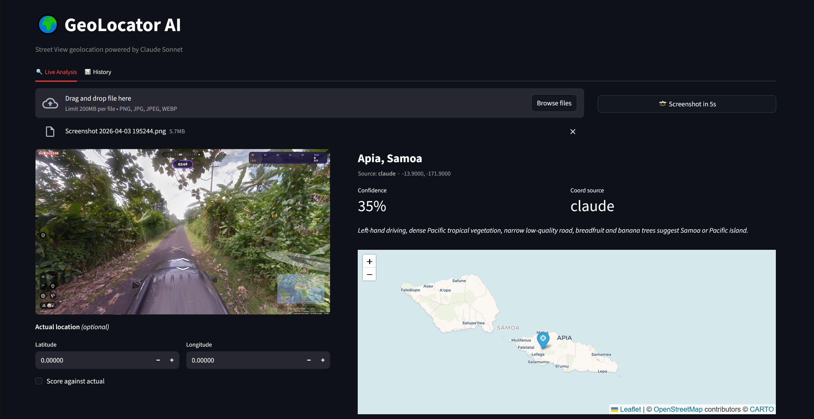
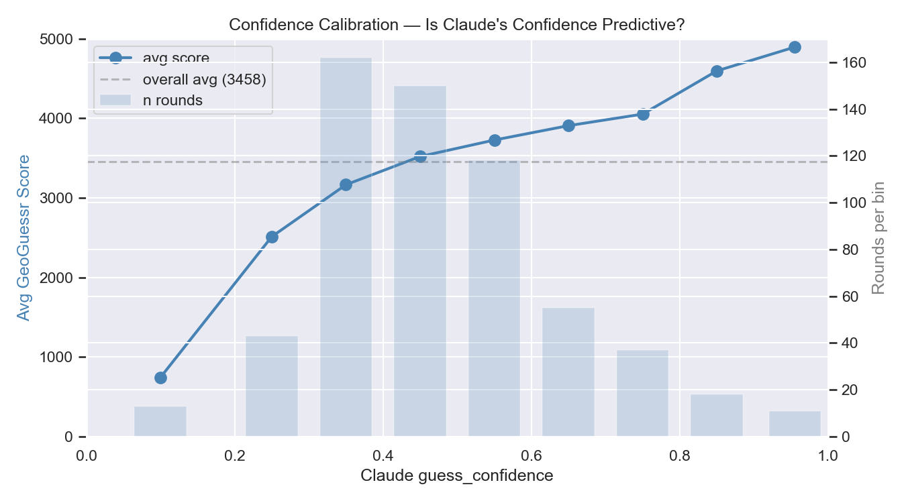
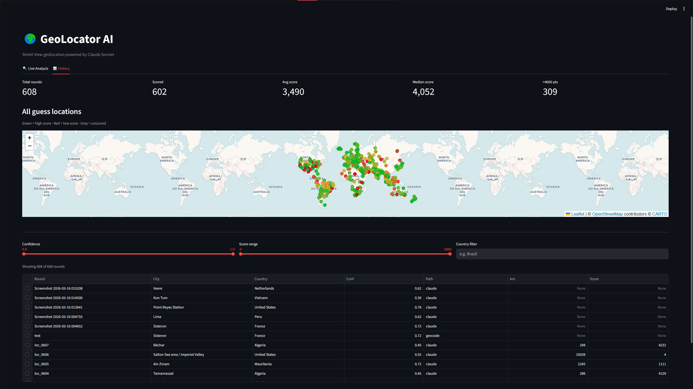

# geolocator-ai

Evaluating and improving VLM reasoning reliability in real-world geospatial inference.

A geospatial image intelligence pipeline that extracts geographic features from Street View imagery using Claude Sonnet's vision API, performs direct location inference, and stores structured results for analytical querying and iterative prompt refinement.

**Result:** 20,740 points in live GeoGuessr gameplay (out of 25,000 max)  
**Stack:** Python · Claude Sonnet · DuckDB · Polars · Streamlit

**[Full Project Report (PDF)](docs/GeoLocator_AI_Report.pdf)**



---

## Results

| Version | Avg Score | Median | Details |
|---------|-----------|--------|---------|
| V1 Bayesian pipeline | 1,025 | 350 | 43% wrong continent (feature decomposition degraded inference) |
| V2 Direct inference (607 rounds) | 3,490 | 4,052 | 51% of rounds over 4,000 pts |
| Live GeoGuessr Game 1 | 19,379 | — | 5 rounds: 4,057 · 4,460 · 4,842 · 1,218 · 4,802 |
| Live GeoGuessr Game 2 | **20,740** | — | 5 rounds: 2,583 · 4,964 · 4,992 · 3,210 · 4,991 |

### Key findings

- **VLMs should be guided, not decomposed.** Bayesian feature scoring degraded Claude's inference by 240%. Direct inference outperforms structured scoring.
- **Confidence is calibrated.** Claude's self-assessed confidence is linearly predictive of actual accuracy (745 avg at low confidence → 4,893 at high).
- **Geographic bias exists.** Claude systematically guesses the American Southwest for arid landscapes regardless of hemisphere. South Africa is misidentified as USA 62% of the time.
- **Prompt placement matters.** Instructions placed as post-guess validation checks are more effective than the same instructions placed as background knowledge.



---

## Quick start

```bash
git clone https://github.com/arextan/geolocator-ai.git
cd geolocator-ai
python -m venv venv
venv\Scripts\activate          # Windows
source venv/bin/activate       # Mac/Linux
pip install -r requirements.txt

# Create .env file with your API keys
echo ANTHROPIC_API_KEY=your-key-here > .env
echo GOOGLE_MAPS_API_KEY=your-key-here >> .env  # Only needed for data collection

# Test on a single image
python evaluate.py path/to/screenshot.png

# Launch the app
streamlit run app.py
```

### Required API keys (.env)

```
ANTHROPIC_API_KEY=sk-ant-...
GOOGLE_MAPS_API_KEY=AIza...     # Only needed for data collection
```

---

## How it works

```
Screenshot → extractor.py (features + location guess in ONE Claude call)
           → router.py (geocode override if place name found)
           → geo.py (select best coordinates)
           → DuckDB (structured storage)
           → analyze.py (error patterns → prompt improvements)
           → Streamlit (interactive display)
```

A single Claude Sonnet API call analyzes the image and returns:
- **20 structured geographic features** (script, language, driving side, biome, architecture, road markings, etc.) — stored for analysis
- **A direct location guess** with city, country, coordinates, reasoning, and confidence — used for scoring

If Claude reads a specific place name with high confidence, a Nominatim geocode override provides more precise coordinates. A 100km sanity check prevents mismatched geocodes.

The pipeline implements a confidence-based decision system. When Claude's self-assessed confidence exceeds 0.7, the direct inference coordinates are accepted with high trust. When a geocodable place name is detected with language confidence above 0.8, the geocode path overrides with verified coordinates. For low-confidence rounds, the system's analytical layer flags these for pattern analysis, feeding the iterative prompt refinement loop.

The 20 features are organized into two passes. Pass 1 covers deterministic signals: script type, language, readable text, place names, route numbers, plate format, driving side, speed sign format, domain extensions, and currency symbols. Pass 2 covers probabilistic signals: biome, vegetation species, sky condition, terrain, soil color, architecture style, pole type, road surface, road markings, and infrastructure quality. These were selected from a reference taxonomy of 127 geographic indicators, filtered to the subset Claude can reliably extract without hallucination.

---

## App

The Streamlit interface provides two views:

### Live Analysis

Upload a GeoGuessr screenshot (or use the built-in screenshot tool with 5-second delay) and the pipeline returns a location guess with map, reasoning, and extracted features.


**Features:**
- Drag-and-drop image upload or automatic screenshot capture
- Interactive map with guess pin (blue) and actual pin (green) if provided
- Claude's reasoning and confidence score
- Extracted features in collapsible panel
- Optional actual coordinates for scoring

### History

Browse all processed rounds from DuckDB with filtering and sorting.



**Features:**
- Scatter map of all guess locations colored by score
- Sortable table with round details
- Filter by score range, confidence, country
- Aggregate statistics (avg score, median, rounds over 4,000)

---

## The refinement loop

The pipeline's core methodology is iterative prompt refinement based on empirical error analysis:

```
Run images → analyze errors in DuckDB → identify failure patterns
→ add corrective instructions to prompt → re-run → measure improvement
```

### What the analysis revealed

Key patterns discovered through structured SQL analysis of 607 rounds:

- **South Africa → USA confusion (62%):** Dry terrain with sparse scrubland defaults to American Southwest. Corrected with driving-side checks and South African road marking rules (yellow edge + white center).
- **Vietnam → Thailand confusion (58%):** Corrected with diacritics-based script discrimination.
- **Italy → Portugal confusion:** Claude correctly extracted "no center line" road markings but didn't apply the rule during inference. Fixed by restructuring the prompt to include post-guess validation checks.
- **VLM geographic bias:** Claude demonstrates systematic bias toward guessing the United States for arid landscapes regardless of hemisphere, which is a pattern only visible through aggregate analysis.

---

## Data collection

607 locations collected via Google Street View Static API:
- 4 headings per location (0°, 90°, 180°, 270°), ~2,400 total images
- Stratified across 17 regions (China excluded due to no Street View coverage)
- Tiered snap radius: dense regions 1km, medium 10km, sparse 50km
- 84% of images have no readable text (deliberately rural-heavy)

```bash
python collect.py --locations 500 --output data/images --dry-run  # Preview distribution
python collect.py --locations 500 --output data/images            # Download images
python main.py --input data/images                                # Process through pipeline
python analysis/analyze.py                                        # Analyze results
```

---

## Project structure

```
geolocator-ai/
├── README.md
├── requirements.txt
├── .env.example
├── config.py                   # API keys, thresholds
│
│   Entry points
├── app.py                      # Streamlit interface with screenshot tool
├── main.py                     # Batch orchestration — idempotent, crash-safe
├── evaluate.py                 # Single-image CLI tool
├── collect.py                  # Street View API image scraper
│
│   Pipeline
├── pipeline/
│   ├── __init__.py
│   ├── extractor.py            # Claude API → features + location guess
│   ├── extraction_prompt.py    # Combined extraction + inference prompt
│   ├── router.py               # Geocode override with 100km sanity check
│   ├── geo.py                  # Coordinate selection
│   ├── scoring.py              # Haversine distance + GeoGuessr points
│   ├── scorer.py               # Bayesian scoring (analytical only)
│   ├── feature_region_map.py   # 127-feature knowledge base
│   └── centroids.json          # Coverage-weighted centroids
│
│   Analysis
├── analysis/
│   ├── __init__.py
│   ├── analyze.py              # Feature importance, confusion matrix
│   ├── calibrate.py            # Threshold analysis
│   └── sanity_check.py         # Quick DB diagnostics
│
│   Data & storage
├── data/images/                # Collected images + sidecar JSONs
├── geoguessr.db                # DuckDB storage
│
│   Documentation
└── docs/
    ├── geolocator_ai_report.pdf
    ├── score_distribution.png
    ├── confidence_calibration.png
    ├── worst_rounds.csv
    ├── app_live_analysis.png
    ├── app_history.png
    ├── pipeline.md
    ├── data_model.md
    └── feature_reference.md
```

---

## Example queries

```sql
-- Where does Claude fail?
SELECT round_id, guessed_country, distance_km, guess_reasoning
FROM rounds WHERE geoguessr_score < 500
ORDER BY distance_km DESC;

-- Feature effectiveness
SELECT unnest(features_used) AS feature,
       COUNT(*) AS times_used,
       ROUND(AVG(geoguessr_score)) AS avg_score
FROM rounds GROUP BY feature ORDER BY avg_score DESC;

-- Country accuracy
SELECT guessed_country, COUNT(*) AS rounds,
       ROUND(AVG(geoguessr_score)) AS avg_score
FROM rounds GROUP BY guessed_country ORDER BY avg_score DESC;

-- Confidence calibration check
SELECT 
    CASE WHEN guess_confidence >= 0.7 THEN 'high'
         WHEN guess_confidence >= 0.4 THEN 'medium'
         ELSE 'low' END AS tier,
    COUNT(*) AS rounds,
    ROUND(AVG(geoguessr_score)) AS avg_score
FROM rounds GROUP BY tier;

-- High confidence failures (prompt refinement targets)
SELECT round_id, guess_confidence, geoguessr_score, 
       guessed_country, guess_reasoning
FROM rounds WHERE guess_confidence > 0.7 AND geoguessr_score < 1000;
```

---

## The Bayesian experiment

The initial architecture extracted features, scored them against Bayesian likelihood tables for 18 world regions, and resolved the top region to a centroid coordinate. This approach averaged 1,025 points with 43% of rounds guessing the wrong continent.

**Why it failed:** Decomposing Claude's visual understanding into discrete categorical features and reassembling them via likelihood multiplication acted as lossy compression. Claude correctly identified features but the scoring layer combined them less effectively than Claude's own reasoning.

**What replaced it:** A single Claude call that extracts features AND infers the location directly. Same features stored for analysis, but the guess comes from Claude's inference, not from Bayesian math. This improved average score by 240%.

The Bayesian scorer remains in the codebase as an analytical tool for producing feature importance rankings and confusion matrices.

---

## Performance details

### Training dataset (607 rural images)
- Average: 3,490 · Median: 4,052
- 51% of rounds score above 4,000
- 9% of rounds score below 500
- Geocode path (10 rounds): 4,734 avg
- Claude direct path (593 rounds): 3,471 avg
- Text detection rate: 16%

### Confidence buckets
| Confidence | Rounds | Avg Score |
|------------|--------|-----------|
| High (≥0.7) | 99 | 4,172 |
| Medium (0.4–0.7) | 366 | 3,518 |
| Low (<0.4) | 138 | 2,929 |

### Top confusion pairs
| Actual | Guessed As | Error Rate |
|--------|-----------|------------|
| South Africa | USA/Mexico | 62% |
| Vietnam | Thailand | 58% |
| Canada | USA | 72% |
| Sweden | Finland | 50% |

---

## Real-world applications

- **OSINT and defense analysis**: Determining the geographic origin of images and videos with structured evidence trails and measurable confidence levels
- **Fraud detection**: Verifying that seller locations and listing photos match claimed geographic origins by checking for visual inconsistencies (e.g., wrong driving side, mismatched road markings)
- **Content moderation**: Detecting misrepresented locations in user-submitted imagery
- **Disaster response**: Rapid geolocation of damage imagery from social media or field reports, where the pipeline's ability to process text-free imagery (84% of training data) is directly relevant

---

## Known limitations

- **Replica environments** (theme parks, cultural villages) present foreign architecture indistinguishable from the real country in a single frame
- **Rural accuracy ceiling**: 84% of training images have no text; eucalyptus plantations on red soil look identical in Thailand and Brazil
- **VLM geographic bias**: Claude defaults to the American Southwest for arid landscapes regardless of hemisphere
- **Prompt engineering ceiling**: prompt refinement yielded +32 pts on the training dataset; remaining failures are genuinely ambiguous locations
- **Countries without Street View** (China, North Korea): Claude can infer these from training knowledge but accuracy is unmeasured
- **607 samples**: sufficient for identifying patterns, not for robust per-country statistics

---

## Tech stack

| Layer | Tool | Why |
|-------|------|-----|
| Runtime | Python 3.11+ | Standard for analytics |
| Vision + Inference | Claude Sonnet | Structured extraction + geolocation in one call |
| Geocoding | geopy + Nominatim | Free, sufficient volume |
| Spatial | GeoPandas + Shapely | Point-in-polygon operations |
| Dataframes | Polars | Faster than pandas, cleaner API |
| Storage | DuckDB | Analytical SQL queries, zero infrastructure |
| App | Streamlit + Folium | Interactive UI with maps |
| HTTP | httpx | Async image collection |
| Analysis | scikit-learn, matplotlib, seaborn | Feature importance + charts |
| Image Processing | Pillow | Auto-resize for API limits |

---

## License

MIT
